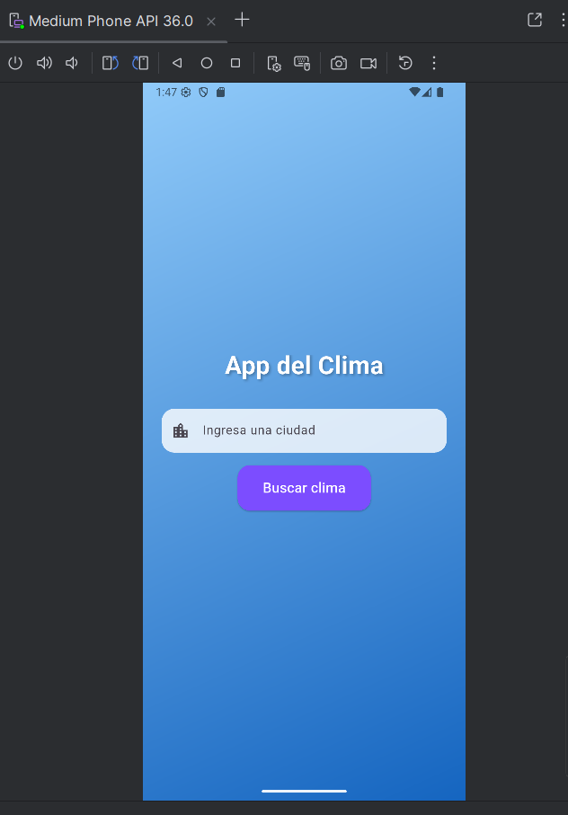
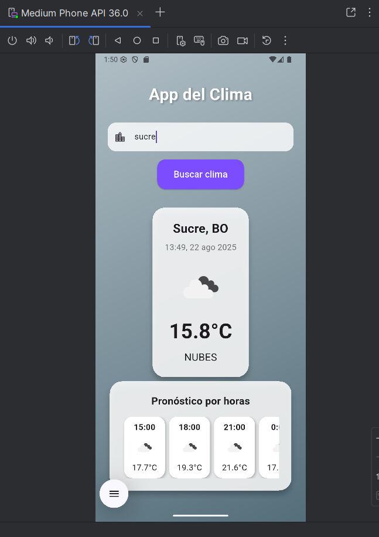
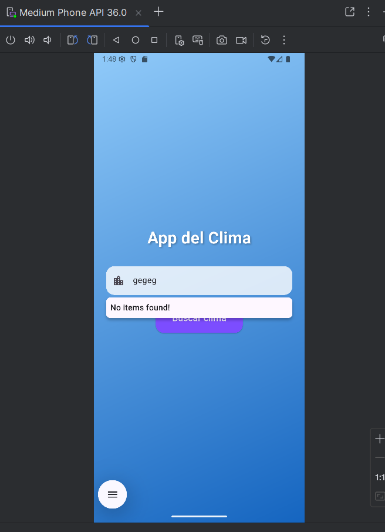

# App del Clima (Flutter)

Aplicación móvil Flutter para consultar el clima actual y el pronóstico por horas de cualquier ciudad usando la API de OpenWeatherMap.

## Demostración

Pantalla principal:



Búsqueda exitosa (ciudad válida):



Mensaje de error (ciudad inexistente):




## Características
- Búsqueda de clima por ciudad con autocompletado.
- Visualización de temperatura, descripción, ícono, humedad, viento, etc.
- Pronóstico por horas para el día actual.
- Mensajes de error claros si la ciudad no existe.
- Interfaz elegante y responsiva.

## Requisitos previos
- Tener instalado [Flutter](https://docs.flutter.dev/get-started/install) en tu sistema.
- Tener una cuenta en [GitHub](https://github.com/).
- Tener una API Key de [OpenWeatherMap](https://openweathermap.org/api).

## Instalación y ejecución local

1. **Clona este repositorio** (o inicializa uno nuevo):
   ```sh
   git clone https://github.com/Andrew3014/app-de-clima.git
   cd app-de-clima
   ```
   O si ya tienes el proyecto local, inicializa git:
   ```sh
   git init
   git remote add origin https://github.com/Andrew3014/app-de-clima.git
   ```

2. **Instala las dependencias:**
   ```sh
   flutter pub get
   ```

3. **Configura tu API Key:**
   - Abre el archivo `lib/main.dart`.
   - Busca la línea:
     ```dart
     final String apiKey = 'AQUI_TU_API_KEY';
     ```
   - Coloca tu API Key de OpenWeatherMap entre comillas.

4. **Activa el modo desarrollador en Windows (si es necesario):**
   - Ejecuta en PowerShell:
     ```sh
     start ms-settings:developers
     ```
   - Activa "Modo de programador".

5. **Ejecuta la app:**
   - Con un emulador o dispositivo conectado:
     ```sh
     flutter run
     ```

## Subir el proyecto a GitHub

1. **Agrega todos los archivos al repositorio:**
   ```sh
   git add .
   ```
2. **Haz tu primer commit:**
   ```sh
   git commit -m "Proyecto app del clima Flutter"
   ```
3. **Sube los cambios a tu repositorio remoto:**
   ```sh
   git push -u origin main
   ```
   > Si tu rama principal se llama `master`, reemplaza `main` por `master`.

## Notas
- Si tienes problemas con dependencias, ejecuta `flutter pub get` nuevamente.
- Si tienes problemas con permisos en Windows, asegúrate de tener el modo desarrollador activado.
- Puedes personalizar el diseño y agregar más detalles del clima según tus necesidades.

## Licencia
Este proyecto es solo para fines educativos.
